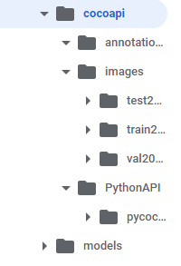
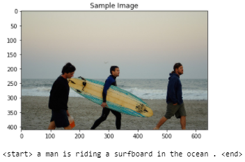
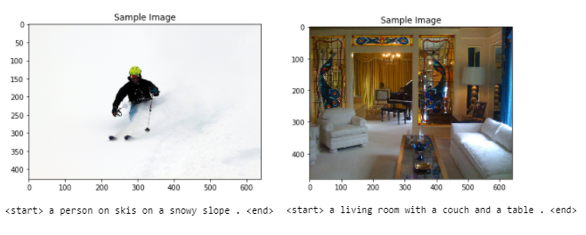
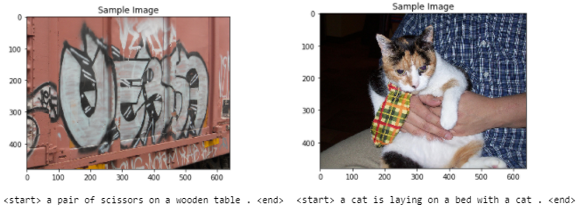
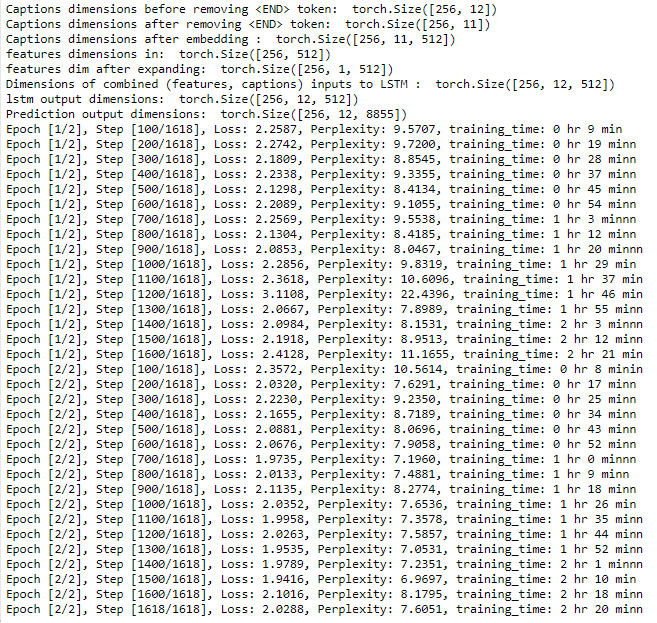
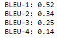

# Image-Captioning-Project
Generate caption on images using CNN Encoder- LSTM Decoder structure

This project is the second project of Udacity's Computer Vision Nanodegree and combines computer vision and machine translation techniques. The project's objective is a generative model based on a deep recurrent architecture to generate natural sentences describing an image. The model is trained to maximize the likelihood of the target description sentence given the training image.

The principles of this technique was presented in the following [paper](https://arxiv.org/pdf/1411.4555.pdf) back in 2015. It was later enriched in "Show, Attend and Tell" [paper](https://arxiv.org/abs/1502.03044) from 2016. I covered an implementation of this approach in another [repository](https://github.com/LaurentVe/Automatic-image-Captioning) for those interested. I also covered an implementation of Image Captioning in Keras on the Flickr dataset [here](https://github.com/LaurentVe/Image-Captioning-full-Encoder-Decoder-model-).

# Description
The project is structured as a series of Jupyter notebooks and three helpers .py files:
- 0_Dataset.ipynb
- 1_Preliminaries.ipynb
- 2_Training.ipynb
- 3_Inference.ipynb

The project uses Pytorch and the MS COCO dataset for training. COCO is a large image dataset designed for object detection, segmentation, person keypoints detection, stuff segmentation, and caption generation. The dataset contains images with 5 pre-made captions each. The large majority of these captions are between 8 to 15 words long.
COCO datasets can be found [here](https://cocodataset.org/#download).

The model is composed of two parts:
- An Encoder wich uses pre-trained ResNet50 network to extract features from the images. The feature volume is passed thru a fully connected layer with the same number of nodes as the word embedding used in the second part below. This allows to combine extracted spacial features from the images and the sampled captions during training. I added a Batchnorm1d layer at the end.
- A Decoder primarily composed of a LSTM network. The decoder takes on the sample captions during the training phase and generates a caption for a new image during inference, 'decoding' the proposed features extracted from the image. A fully connected layer at the end allows to map the hidden space of the LSTM to the vocab space, producing a prediction for each word sequentially.

Words proposed to the Decoder are pre-processed using tokenization and a word embedding step. Using an embedding has the advantage of being independent of the size of the dictionary (contrary to a simpler onehot-encoding approach). Each word is represented by a fixed sized vector in the embedding space. The same embedding dimension is used on the extracted image features which allows to concatenate both (features, caption) as input pair for the training. Using its memory capabilities, the LSTM learns to map words to the specific features extracted from the images and to form a meaningful caption summarizing the scene. The embedding, jointly trained during learning, contributes to the performance: The learned representations captures some semantic of the language, helping the vision component by defining coherent proximities between words.

# Parameters of the Decoder model
in details:
- Encoder: Pre-trained ResNet > FC layer with embed_size > batchnorm1d. A BarchNorm1d layer may help equalizing the features.
- Decoder: Embeddings (Embed size) > LSTM (1 layer, hidden dim and drop out) > DropOut(0.5) > FC layer (Vocab size)

Based on previous literature (see this [paper](https://arxiv.org/pdf/1411.4555.pdf)), I used the following hyperparameters:
- word Embedding dimension of 512
- Hidden dimension of 512
- Batch size of 256
- One LSTM layer
- Vocab threshold of 5 (vocabulary composed by the words with 5 occurences or more in the training dataset). Total vocabulary of 8.855 words.

Parameters set to be learned: All Decoder parameters, the fully connected layer from the Encoder as well as the batchNorm1d. These are all the parameters required to learn the mapping between the spacial representation from the features and the words to compose the captions. They include the word embedding which is learned in the process. The feature extractor in the Encoder uses pre-trained weights to benefit from transfer learning.

Overall the model has 12.227.735 learnable parameters (the pre-trained CNN extractor is fixed).

I used Adam optimizer with standard parameters. Adam is reputed to [perform well on large amount of data](https://arxiv.org/pdf/1609.04747.pdf). Results achieved after one epoch were promising and improved with further training (3 epochs in total, for a total of 8 hours). Samples are shown below.

Note: Applying BatchNormalization to the LSTM is not considered. In any non-recurrent network, BN implies each layer gets to adjust the incoming scale and mean so the incoming distribution for each layer doesn't keep changing (which is what the authors of the BN paper claim is the advantage of BN). The problem with doing this for the recurrent outputs of an RNN is that the parameters for the incoming distribution are now shared between all timesteps. So the distribution ends up being fixed across the temporal layers. This may not make sense as there may be structure in the data that varies across the time series. For example, if the time series is a sentence certain words are much more likely to appear in the beginning or end. So having the distribution fixed might reduce the effectiveness of BN.

# Next ?

Refine the architecture introducing two LSTM layers and reducing the dropout rate (target a keep ratio of 0.75). This is based on the following detailed analysis paper [Learning CNN-LSTM Architectures for Image Caption Generation](https://cs224d.stanford.edu/reports/msoh.pdf).

# How to run
- download the repo as the working folder
- download the COCO PythonAPI folder and place into a folder `cocoapi` inside the working folder. The API can be found [here](https://github.com/cocodataset/cocoapi)
- download the [COCO dataset](https://cocodataset.org/#download), unzip and place the images into a folder `cocoapi/images` and the annotations into `cocoapi/annotations
- run the notebooks

The folder structure inside the repo hosting the notebooks should look like this:

# Results

After one epoch: The context of the image is already captured in the proposed caption but it remains approximative ('surfboard' and 'ocean' correct, 'ridding' not correct).

After two epochs: For most images, the context is fully captured in the proposed caption (but there are images with totally wrong caption).

examples of wrong caption after 2 epochs:

After four epochs: A few solid captions

Summary of training :

bleu scores:

